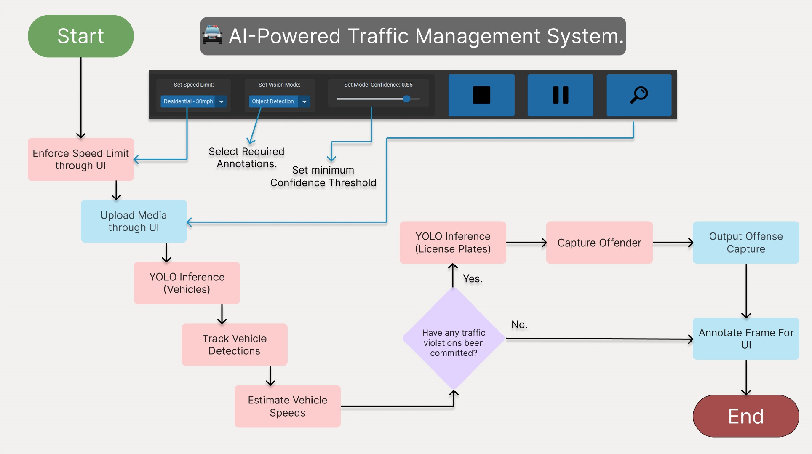
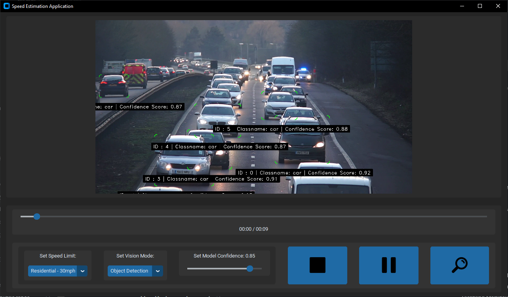
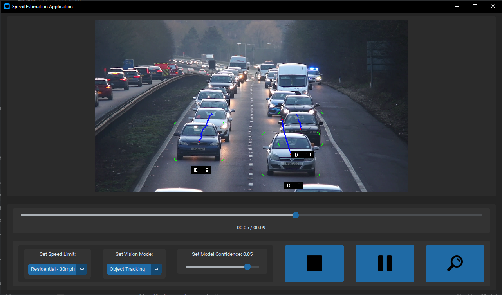
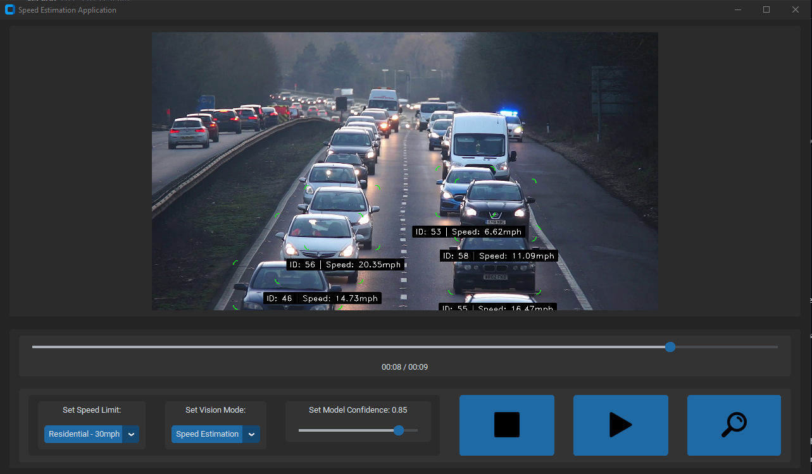
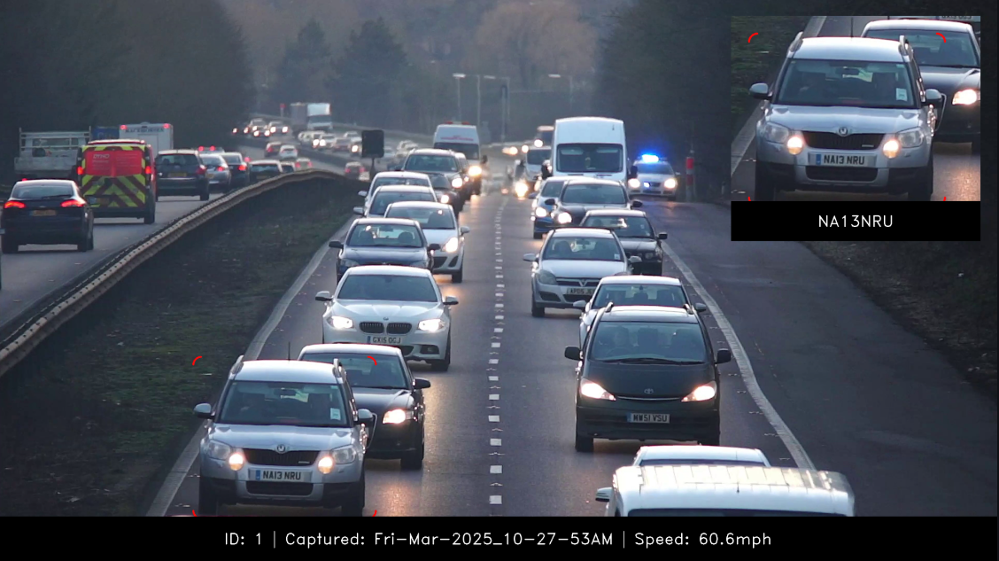

# 🚔 AI-Powered Traffic Management System.

## Overview

Embracing the future of AI, this implementation can be used to automate the workflow of traffic management. Enhancing road safety and efficiency whilst providing AI driven insights. 

Since current solutions for traffic management in the UK are either inactive or outdated, this example serves to prove the attainability for real time processing without the need for manual interaction.

# 📖 Table of Contents

---
1. [Flowcharts](#Flowcharts)
2. [Benefits](#Benefits)
3. [UseCases](#UseCases)
4. [Features](#Features)
5. [Prerequisites](#Prerequisites)
6. [Setup](#Setup)
7. [Configuration](#Configuration)
8. [RunningTheProject](#Run)
---

## Flowcharts

Here is a quick system overview, abstracting the logical flow of the main processing pipeline.


## Benefits

The key benefits of this systems implementation are.

```
Key Benefits:
    - **Enhanced Road Safety:** Quickly identify offenders violating trafic laws to enable proactive interventions.
    - **Automation:** Monitoring process is now automated to alleviate the need for manaul, human driven, oversight.
    - **AI-Driven Insights:** Returns detailed analytics on traffic which can help lead to better informed decision making.
```

## UseCases

Specific implementations of this software include but are not limited to.

```
Use Cases:
    - Capture Speeding Offenses.
    - Parking Management.
    - Security Access Control.
```

## 🚀 Features

    ✔️ Real-time Object Detection with YOLO V11
        - High confidence detection for mitigation of false positives.
        - Classname filtration to cull irrelevant detections.


-------------------------------------------------------------------------------

    ✔️ Object Tracking
        - Assign IDs to detections.
        - Estimate detection tracjectory.


-------------------------------------------------------------------------------

    ✔️ Speed Estimation
        - Weighted average of frame based and average speed estimation.
        - Vehicles exceeding the set limit are captured.
        - Customisable speed limits.



-------------------------------------------------------------------------------

    ✔️ License Plate Detection (ANPR)
        - Crop and preprocess license plates.
        - Fed to OCR model. 
        - Processed with proprietary logic and appended to vehicle data
        to capture offending vehicle.



-------------------------------------------------------------------------------

## 🔧 Prerequisites

    > In order for this project to be viable, these components are required. 

    Hardware:

        > Devices with CUDA comptabible GPUs are favoured. Application should be viable on most devices however
            performance will be staggered, unable to leverage hardware acceleration.

    Software:

        > Python 3.11
        > Ultralytics YOLO V11 (https://www.ultralytics.com/yolo)
            - Current V11 model weights included, access the Ultralytics site should there be model issues to access most up to date model.
        > Ultralytics pre-trained YOLO V8.
            - Specifically, trained on this License Plate dataset : (https://universe.roboflow.com/roboflow-universe-projects/license-plate-recognition-rxg4e/dataset/4)
        > OpenCV
        > Numpy
        
-------------------------------------------------------------------------------

## 🛠 Setup

Clone this git repo with:

    > git clone https://github.com/MichaelwaveOfficial/speed_estimator_v3.git

    > cd project folder

-------------------------------------------------------------------------------

Install dependencies:

    > pip install -r requirements.txt 

-------------------------------------------------------------------------------

## ▶️ Run

Run the project:

    > python main.py

